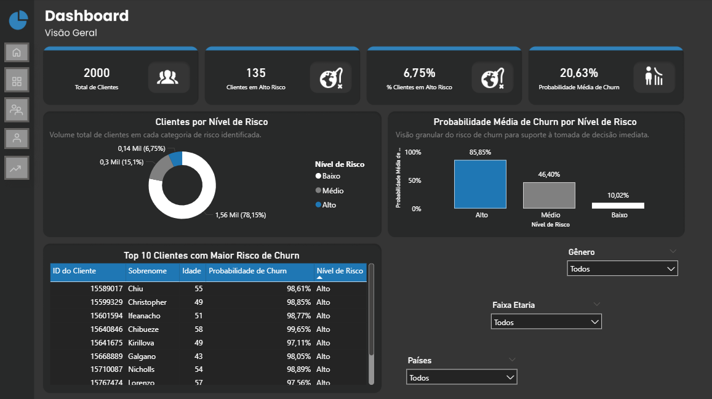
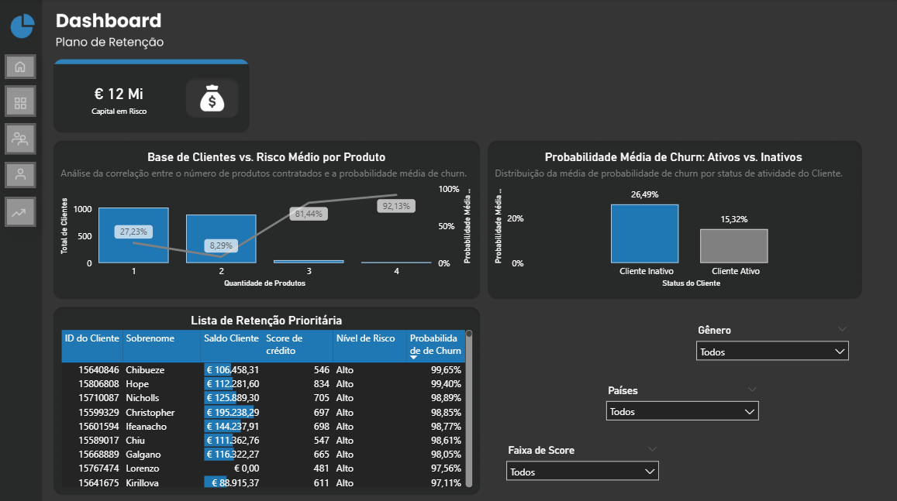
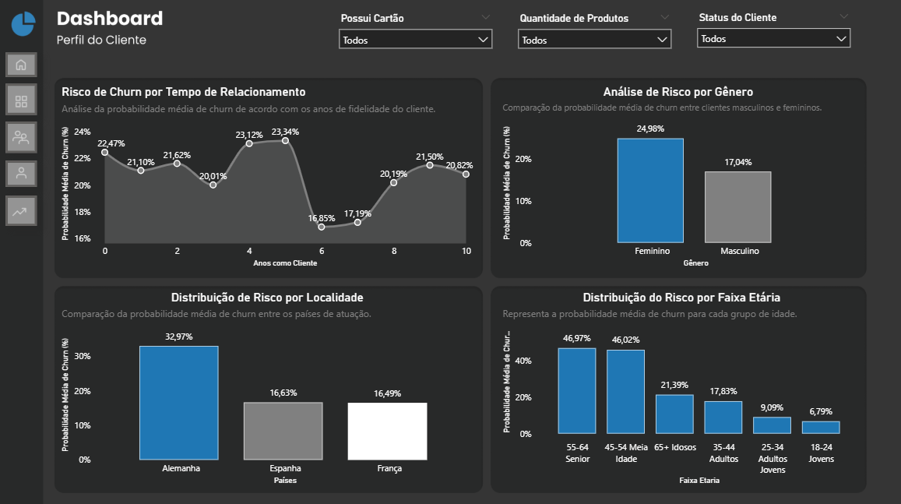
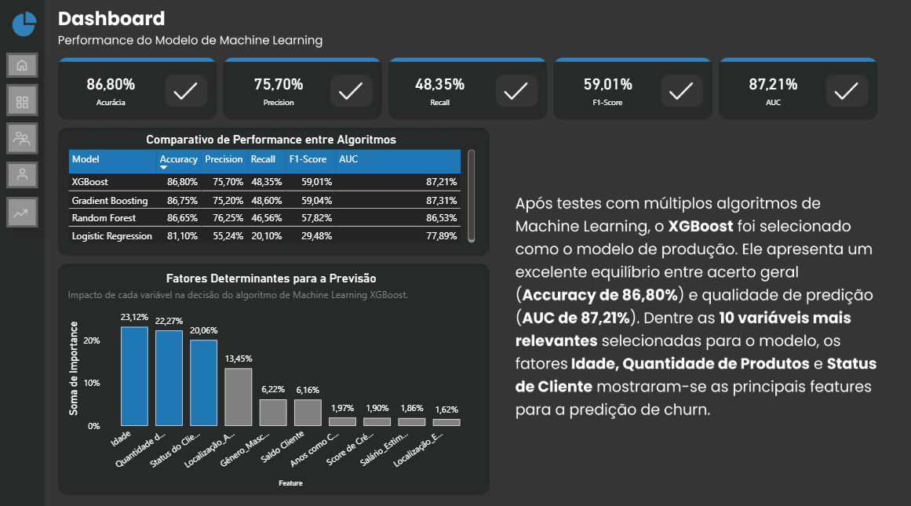

# 🏦 Previsão de Churn Bancário com Machine Learning e Power BI

## 🎯 Visão do Projeto
Este projeto integra **Machine Learning (XGBoost)** e **Business Intelligence** para transformar dados brutos em uma estratégia de retenção de clientes. O foco é identificar preventivamente clientes com alta probabilidade de churn, permitindo que o banco aja de forma proativa para proteger seu capital.

## 🧠 Inteligência de Dados (Python)
A base do projeto foi construída no Jupyter Notebook, onde realizei o ciclo completo de ML:
* **Feature Engineering:** Transformação de variáveis categóricas e tratamento de dados.
* **Model Selection:** Comparação entre Regressão Logística, Random Forest, Gradient Boosting e XGBoost.
* **Otimização:** Uso de `GridSearchCV` para tunagem de hiperparâmetros do **XGBoost**.
* **Performance Final:**
  
    * **Acurácia:** 86,80%
    * **AUC (Área sob a curva ROC):** 87,21%

## 📊 Dashboard Estratégico (Power BI)
O dashboard foi estruturado em **4 visões dinâmicas**, permitindo que diferentes áreas do banco tomem decisões:

### 🏠 Página Inicial (Menu de Navegação)
Interface de entrada com sistema de botões interativos para acesso rápido a todas as áreas do projeto.

### 1. Visão Geral
Monitoramento macro da saúde da base e principais KPIs de churn do banco.

### 2. Plano de Retenção
Identificação nominal de clientes de alto valor e cálculo de **Capital em Risco**.

### 3. Perfil do Cliente
Segmentação demográfica e comportamental para entender profundamente os motivos da saída.

### 4. Performance do Modelo de Machine Learning
Transparência total sobre a importância das variáveis e métricas de validação do modelo XGBoost.

## 📚 Fonte dos Dados

Os dados utilizados foram obtidos no Kaggle:
[Churn Modelling — por Shruti_Iyyer](https://www.kaggle.com/datasets/shrutimechlearn/churn-modelling/data)

## 🛠️ Tecnologias Utilizadas
* **Linguagem:** Python (Pandas, Scikit-Learn, XGBoost, Joblib).
* **Visualização:** Matplotlib, Seaborn e Power BI (DAX avançado).
* **UX/UI:** Design Dark Mode focado em navegabilidade por botões e Tooltips instrucionais.

---
